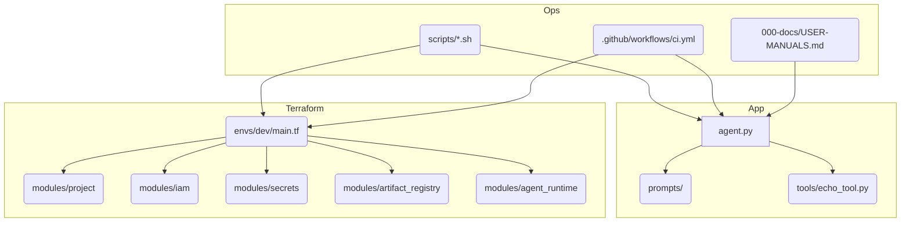

# 🤖 IAM JVP Base — Vertex AI Agent Engine Commander

**JVP (IAMJVP) is a freshly built strategic commander agent template aligned with Google’s ADK + A2A update from six days ago.**

---

## Snapshot

- ADK agent (`app/jvp_agent/agent.py`) + prompts + Vertex AI memory callback.
- A2A bridge (`app/jvp_agent/a2a.py`) exposing the commander skill via `A2aAgent` (uses Vertex AI Sessions + Memory Bank if configured).
- Vertex AI Search tool (`app/jvp_agent/tools/rag_search.py`) for knowledge-grounded results.
- Strategy orchestrator (`app/jvp_agent/tools/strategic_orchestrator.py`) that balances simple risk/opportunity heuristics for quick planning.
- Terraform baseline (`infra/terraform/`) covering project, IAM, Artifact Registry, secrets, and runtime placeholder modules.
- Tooling scripts + CI for formatting, linting, and Terraform validation.
- Deployment helpers (`scripts/deploy_agent_engine.sh`, `.github/workflows/deploy-agent-engine.yml`) to push the agent to Vertex AI Agent Engine via CLI or GitHub Actions.
- Memory helpers (`app/jvp_agent/memory.py`) dynamically enable context caching + compaction when the ADK release supports the new Vertex AI features.
- Packaging script (`scripts/package_agent.py`) builds the pickle/tarball/requirements triple required by Vertex AI Agent Engine deployments.
- Documentation hub (`000-docs/`) and STATUS tracker for outstanding TODO(ask) items.

---

## Architecture Diagram

---

## Quick Links

- [Repository README](../README.md)
- [User Manuals Index](../000-docs/USER-MANUALS.md)
- [Launch Notes](../000-docs/008-AT-RELE-iamjvp-launch.md)
- [Status & TODO(ask)](../STATUS.md)

Fork it, replace the TODO markers as you verify manual updates, and extend the commander into a full Vertex AI deployment.
